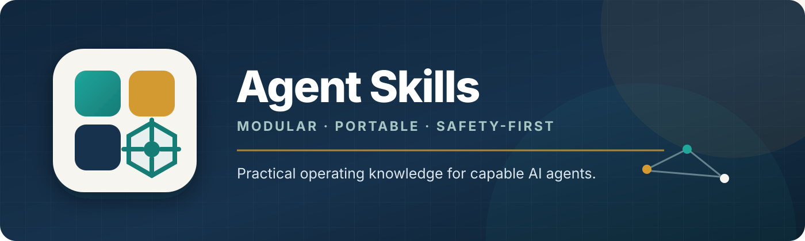

<p align="center">
  
</p>

<p align="center">
  <strong>A curated library of practical operating knowledge for capable AI agents.</strong>
</p>

<p align="center">
  
  
  
  
</p>

Agent Skills turns general-purpose coding agents into more dependable specialists. Each skill combines
clear trigger metadata with compact workflows, safety boundaries, verification steps, and focused
reference material. The collection covers document production, data work, and engineering workflows
without tying the source to one agent runtime.

> [!NOTE]
> Skills are instructions, not dependency bundles. Install format-specific libraries and system tools
> only when a task needs them.

## Why this collection

- **Operational, not encyclopedic.** Skills emphasize decisions, failure modes, and verification.
- **Safety-first.** Existing files, unrelated Git changes, signatures, macros, and production data are
  preserved unless the user explicitly authorizes otherwise.
- **Portable.** Every capability follows the open `name/SKILL.md` folder convention.
- **Progressively disclosed.** Core instructions stay focused; deeper recipes live in `references/`.
- **Human-auditable.** Markdown source, deterministic installation, and explicit tool choices make the
  library easy to review and adapt.

## Quick start

```bash
git clone https://github.com/RobbyBobby77/agent-skills.git
cd agent-skills
bash ./install.sh
```

The installer discovers every folder containing `SKILL.md`, creates symlinks, and verifies that Codex
resolves all installed skills back to this checkout.

| Agent | Install location |
|---|---|
| Codex | `~/.codex/skills` |
| Claude Code | `~/.claude/skills` |
| Cursor | `~/.cursor/skills` |
| Grok | `~/.grok/skills` |

Reload the agent after installation if its skill catalog was already open.

## The collection

### Documents and communication

| Skill | Designed for |
|---|---|
| [`docx`](docx/SKILL.md) | Word creation, template editing, tracked changes, comments, and visual QA |
| [`pptx`](pptx/SKILL.md) | Presentation creation and editing with mandatory render–inspect–fix QA |
| [`xlsx`](xlsx/SKILL.md) | Excel models, formulas, formatting, charts, validation, and macro-aware editing |
| [`pdf`](pdf/SKILL.md) | Extraction, generation, forms, OCR, merge/split, watermarking, and rendering |
| [`markdown`](markdown/SKILL.md) | READMEs, ADRs, RFCs, changelogs, wikis, and documentation sites |
| [`email-html`](email-html/SKILL.md) | Responsive transactional and marketing email with plain-text alternatives |
| [`diagrams`](diagrams/SKILL.md) | Mermaid, PlantUML, D2, ASCII, SVG, architecture, sequences, ERDs, and flows |
| [`ics`](ics/SKILL.md) | Timezone-correct calendar events, recurrence, invitations, updates, and cancellation |

### Data and structured information

| Skill | Designed for |
|---|---|
| [`csv`](csv/SKILL.md) | Encoding-aware flat-file inspection, cleanup, validation, merge, and handoff |
| [`data-analysis`](data-analysis/SKILL.md) | Metrics, EDA, cohorts, funnels, experiments, charts, and trustworthy reporting |
| [`sql`](sql/SKILL.md) | Dialect-aware queries, migrations, indexes, execution plans, and data modeling |
| [`json-yaml`](json-yaml/SKILL.md) | JSON, JSONC, YAML, TOML, schemas, conversion, and round-trip-safe configuration |

### Engineering workflows

| Skill | Designed for |
|---|---|
| [`git-pr`](git-pr/SKILL.md) | Scoped commits, branch safety, rebasing, conflict handling, and PR/MR packaging |
| [`api`](api/SKILL.md) | REST and OpenAPI contracts, auth, pagination, errors, webhooks, and compatibility |
| [`testing`](testing/SKILL.md) | Focused unit, integration, and end-to-end tests across common ecosystems |
| [`docker`](docker/SKILL.md) | Dockerfiles, Compose, multi-stage builds, healthchecks, networking, and hardening |

## How a skill works

```text
skill-name/
├── SKILL.md               # trigger metadata + core operating workflow
├── agents/
│   └── openai.yaml        # user-facing catalog metadata
└── references/            # optional deep dives loaded only when needed
```

An agent first sees the skill's `name` and `description`. When the request matches, it loads the body
of `SKILL.md`; references are opened only when the selected workflow requires them. This keeps the
always-on context small while preserving depth for complex tasks.

## Quality bar

Every skill is expected to:

1. Define when it should—and should not—trigger.
2. Inspect the existing artifact or repository before changing it.
3. Preserve originals and unrelated user work by default.
4. Choose the least destructive tool that can maintain required fidelity.
5. Validate structure, behavior, and rendered output in proportion to risk.
6. Report assumptions, limitations, checks performed, and output locations.

High-risk workflows add stricter boundaries. The Git skill does not silently stash or rewrite shared
history; SQL defaults to read-only analysis; document skills warn about signatures, macros, linked
media, and format-specific loss.

## Project-local installation

To expose this collection only inside one repository:

```bash
mkdir -p .agents/skills
skills_root="/absolute/path/to/agent-skills"

for skill_file in "$skills_root"/*/SKILL.md; do
  skill_name=$(basename "$(dirname "$skill_file")")
  ln -sfn "$(dirname "$skill_file")" ".agents/skills/$skill_name"
done
```

## Optional toolchain

Install dependencies in a project virtual environment or project-local package setup. The following
tools cover most examples, but no task needs the entire list.

<details>
<summary><strong>Node, Python, and system dependencies</strong></summary>

```bash
# Node
npm install docx pptxgenjs mjml

# Python
python -m pip install openpyxl xlsxwriter pandas polars pypdf pdfplumber \
  reportlab "markitdown[all]" pdf2image pytesseract python-pptx pyyaml \
  jsonschema icalendar matplotlib seaborn plotly

# System tools, as needed
# pandoc libreoffice poppler-utils qpdf tesseract-ocr docker
```

</details>

## Contributing

Improvements are welcome. Read [CONTRIBUTING.md](CONTRIBUTING.md) before adding or revising a skill.
The short version: keep triggers precise, instructions concise, destructive boundaries explicit, and
examples verifiable.

## Repository status

This is a curated personal collection. Compatibility depends on each agent's support for the
`SKILL.md` directory convention, and optional tool availability varies by environment.
