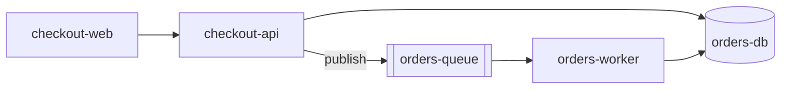
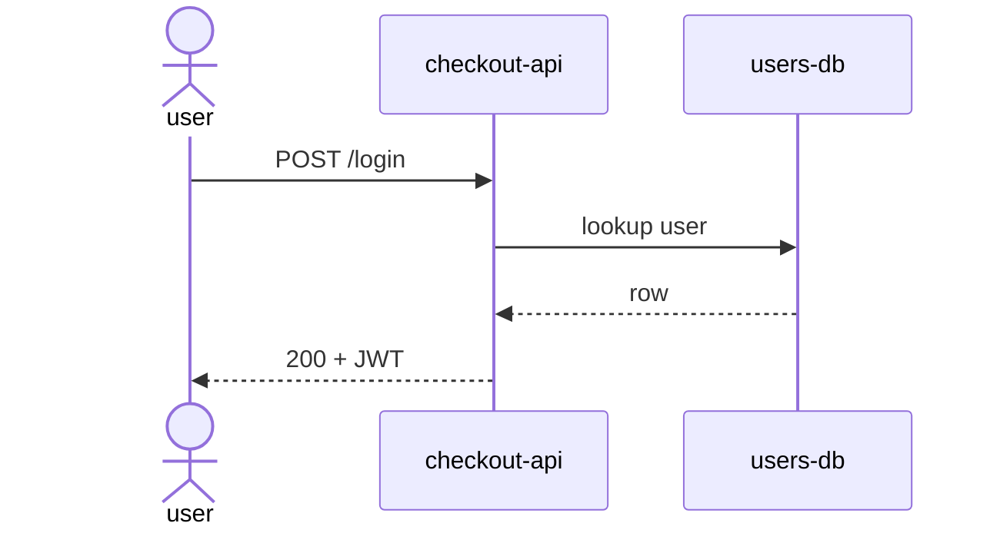
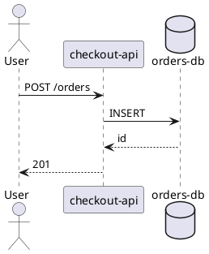

# Diagrams

Agents produce confident architecture diagrams of systems they invented.
This skill exists to stop that, and to keep Mermaid compiling on the renderer
the user actually has.

## Related skills

| Need | Skill |
|------|-------|
| Surrounding README / doc-site page | `markdown` |
| Slide or PDF embed | `pptx` / `pdf` |
| Schema that must match a real database | `sql` |
| KPI charts, not architecture | `data-analysis` |

## Workflow

1. **Collect evidence** — code, existing diagrams, or the user's explicit list. Do not invent components, stores, or edges.
2. **Pick one audience, one level, one message.** If you need two messages, draw two diagrams.
3. **Choose the renderer the destination already uses.** Default to conservative Mermaid for GitHub/GitLab.
4. **Name real things** (`checkout-api`, not `Service 2`). Label edges with verbs.
5. **Validate** syntax for that renderer when a tool exists, and inspect the render. Split anything that becomes a hairball.

**Hard rules**
- No evidence → no box. Missing pieces are drawn as a labeled gap or asked about, not guessed.
- One diagram, one sentence of purpose, written above the figure.
- Do not put secrets, real hostnames, tokens, or customer names in a figure.
- Do not use experimental Mermaid unless you have confirmed the destination's version.
- Do not rebuild a branded slide in Mermaid — export SVG/PNG and use `pptx`.

---

## Evidence

Acceptable sources, in order:

1. Files you opened (compose, terraform, routes, existing C4/mermaid)
2. A list the user typed
3. A question you asked and they answered

Not a source: "typical" microservice layouts, the last system you drew, or a blog-post C4 template.

If the repo and the user disagree, draw the repo and quote the conflict.

---

## Level and type

| Question you are answering | Level / type |
|----------------------------|--------------|
| What talks to this system from outside? | Context (few boxes) |
| Which running processes / stores? | Container |
| What's inside one process? | Component — only if asked |
| Who calls whom, in order? | Sequence |
| What states are legal? | State |
| How do tables relate? | ERD from the real schema |

Direction: `LR` for pipelines, `TB` for layers. Group trust zones and networks with subgraphs. Show failure paths only when that is the message.

---

## Format

| Format | Use when |
|--------|----------|
| **Mermaid** | Default for repo docs and PRs |
| **PlantUML** | Complex UML / C4 the user already renders with PlantUML |
| **D2** | The repo already has `d2` and wants its layout |
| **ASCII** | ≤10 boxes in a comment or tiny README |
| **SVG** | A pixel-exact asset; keep the source next to it |

Renderer failures, reserved words, quoting, and GitHub limits: [references/mermaid.md](references/mermaid.md).

---

## Conservative Mermaid (GitHub-safe)

Write the purpose first. Quote labels that contain punctuation.

````markdown
Purpose: checkout-api reads Postgres and publishes to the orders queue.


````

````markdown
Purpose: login issues a JWT after a user lookup.


````

State and ERDs are fine when the states or tables came from code. Keep IDs simple: `endNode`, never `end`.

---

## When Mermaid is the wrong tool



```d2
direction: right
checkout-web -> checkout-api: HTTPS
checkout-api -> orders-db: SQL
checkout-api -> orders-queue: publish
```

```
[checkout-web] -> [checkout-api] -> [orders-db]
                      \-> [orders-queue]
```

```bash
d2 diagram.d2 diagram.svg
npx --yes @mermaid-js/mermaid-cli -- -i d.mmd -o d.svg
```

---

## Verify

1. Read the diagram out loud as one sentence. If you need a second sentence, split it.
2. Every node and edge has a source in evidence, or is marked unknown.
3. Render, or at least parse, with the destination toolchain when available.
4. Confirm it still fits a README — if GitHub will clip it, it is two files now.
