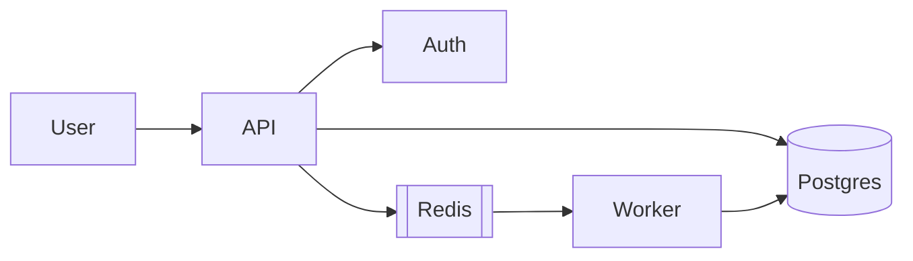
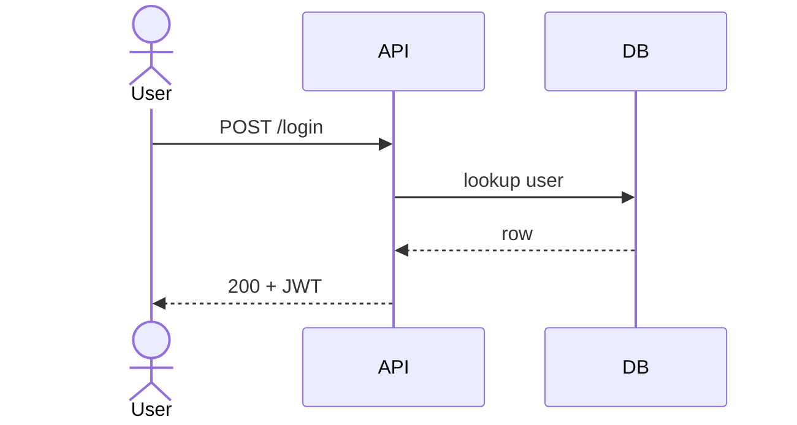
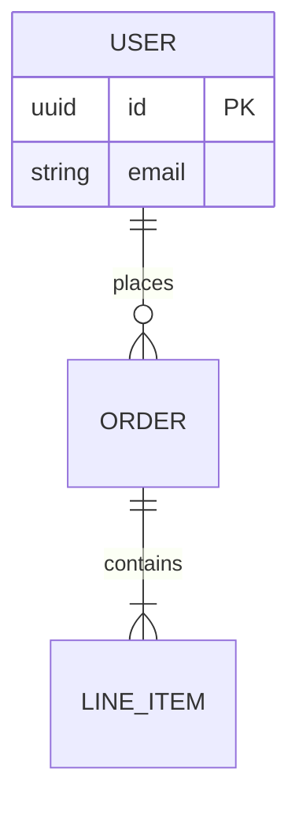
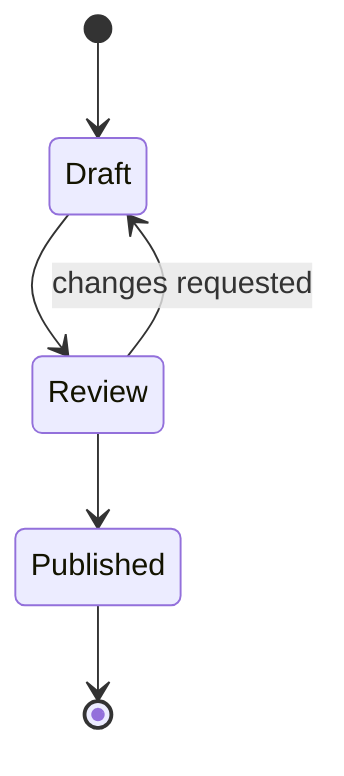
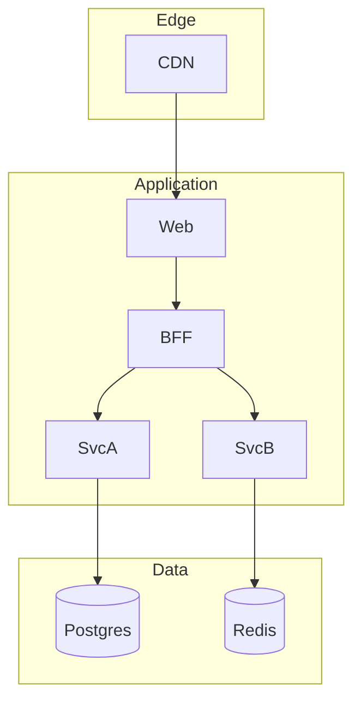
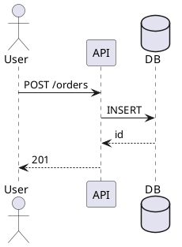

# Diagrams

## Workflow

1. Inspect the source system or requirements; do not invent components or relationships.
2. Choose the audience, abstraction level, diagram type, and renderer.
3. Draft the smallest diagram that communicates one main message.
4. Validate syntax with the target renderer when available and inspect the rendered result.
5. Deliver editable source plus SVG/PNG only when a rendered artifact is useful.

## Choose a format

| Format | Best for | Renders in |
|--------|----------|------------|
| **Mermaid** | Most repo docs, PR descriptions | GitHub, GitLab, many IDEs |
| **PlantUML** | Complex UML, C4, sequences | PlantUML server / local |
| **D2** | Clean modern layouts | d2 CLI |
| **ASCII** | Tiny flows in code comments | Everywhere |
| **SVG** | Pixel-perfect final assets | Browsers |

Default to **Mermaid** unless the user specifies otherwise.

---

## Mermaid essentials

### Flowchart

````markdown

````

### Sequence

````markdown

````

### ER diagram

````markdown

````

### State

````markdown

````

### C4-ish (flowchart)



More patterns: [references/mermaid.md](references/mermaid.md)

---

## Style rules that make diagrams readable

1. **One message per diagram** — split mega-diagrams
2. **Label edges** with verbs (`auth`, `publishes`, `reads`)
3. **Group** with subgraphs / boundaries (trust zones, networks)
4. **Consistent direction** — `LR` for pipelines, `TB` for layers
5. **Name real things** — `checkout-api` not `Service 2`
6. **Show failure paths** only when relevant (else clutter)
7. **Avoid** 20-node hairballs — use leveled views (context → container → component)

---

## PlantUML sequence (when Mermaid struggles)



## D2 sketch

```d2
direction: right
user -> api: HTTPS
api -> db: SQL
api -> queue: publish
queue -> worker
worker -> db
```

```bash
d2 diagram.d2 diagram.svg
```

---

## ASCII (comments / small READMEs)

```
[Client] -> [TLS Term] -> [API] -> [DB]
                     \-> [Cache]
```

Keep under ~10 boxes.

---

## Export / embed

- Mermaid: paste fenced block into Markdown (GitHub renders live)
- CLI: `@mermaid-js/mermaid-cli` → `mmdc -i d.mmd -o d.svg`
- For PPTX/PDF: export SVG/PNG then embed via those skills

---

## Pitfalls

- Mermaid breaks on unquoted special chars in labels — use quotes `"A/B test"`
- `end` is a reserved word — don't use as node id
- Huge diagrams fail GitHub render limits — split files
- Don't put secrets in diagrams
- Renderer support varies by Mermaid version — avoid experimental syntax unless the target supports it
