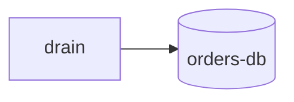
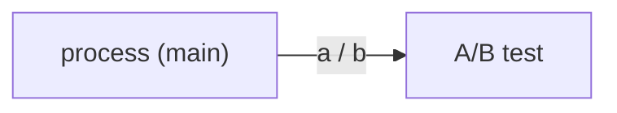
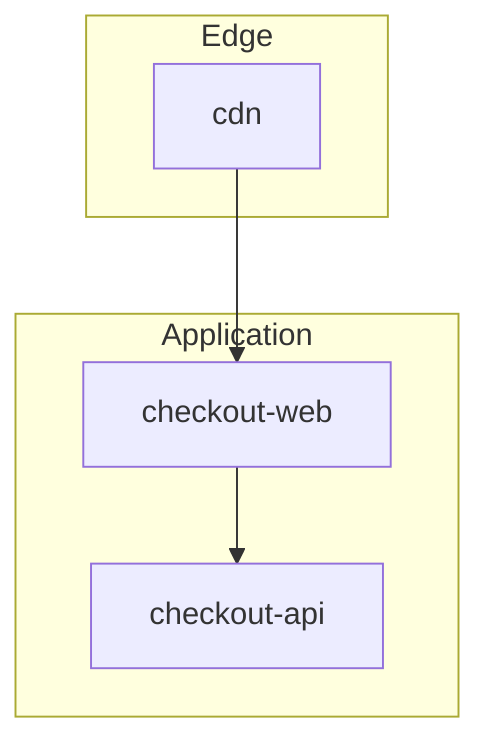

# Mermaid that fails on real renderers

GitHub, GitLab, and most preview plugins ship an older Mermaid than the docs
on mermaid.js.org. Stay inside this subset unless you have rendered on the
destination.

## Use

flowchart, sequenceDiagram, erDiagram, stateDiagram-v2

## Avoid unless you have just rendered it there

`mindmap`, `gantt`, `gitGraph`, `pie`, `sankey`, `xychart`, `block-beta`,
experimental `C4Context`, and any `style` / `classDef` that assumes a theme
the host does not ship. If the figure needs those, use PlantUML/D2/SVG.

## Reserved words and quoting

These IDs parse as syntax, not nodes: `end`, `subgraph`, `graph`, `flowchart`,
`click`, `style`, `class`, `classDef`, `direction`.

Quote any label with punctuation, parentheses, brackets, slashes, or arrows:

Unquoted `A/B test`, `foo()`, or `end` is the usual "works in my head, red box
on GitHub" failure.

## Subgraphs

`end` closes a subgraph. A node named `end` inside one will truncate the
diagram. Close every subgraph. Do not nest more than one level on GitHub.

## Sequences

- `participant` / `actor` names: letters, digits, hyphens. Alias with `as` if
  the display name has spaces.
- Messages: `->>` request, `-->>` response. Keep notes short.
- `loop` / `alt` / `opt` must each have their own `end`.

## Size and version

- GitHub will drop or clip very large diagrams. If you are past ~25 nodes or
  ~40 edges, split by level (context vs container) or by slice (sync vs async).
- Do not rely on a feature you saw in the latest Mermaid release notes.
- `init` frontmatter / `%%{init:...}%%` theming is host-dependent — skip it
  unless the repo already uses it.

## Escaping cheatsheet

| Want | Write |
|------|--------|
| Parens in a node | `A["run (main)"]` |
| Slash or arrow in an edge | `A -->|"a → b"| B` |
| Node that would be named end | `endNode[end]` |
| Brackets in text | `A["list [beta]"]` |
| HTML / quotes in a label | Don't. Rephrase. |
