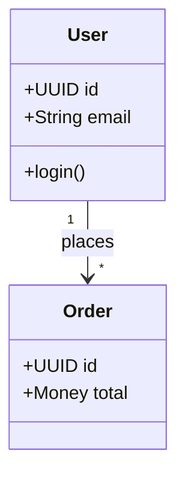
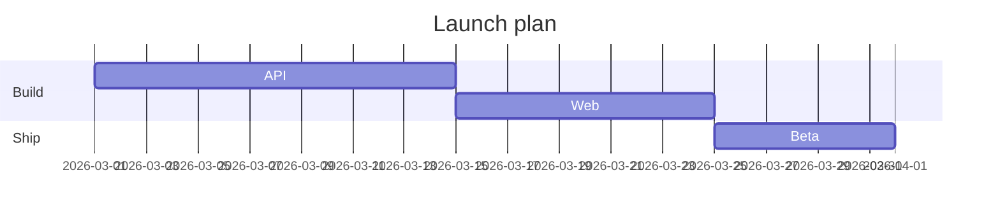
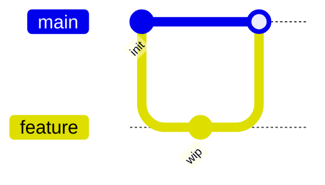
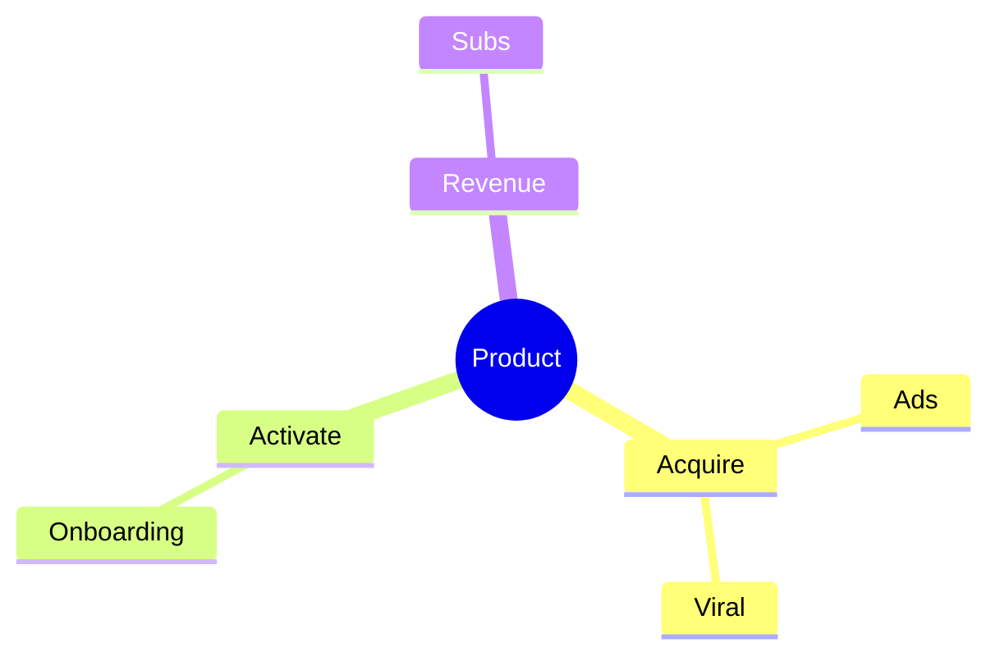
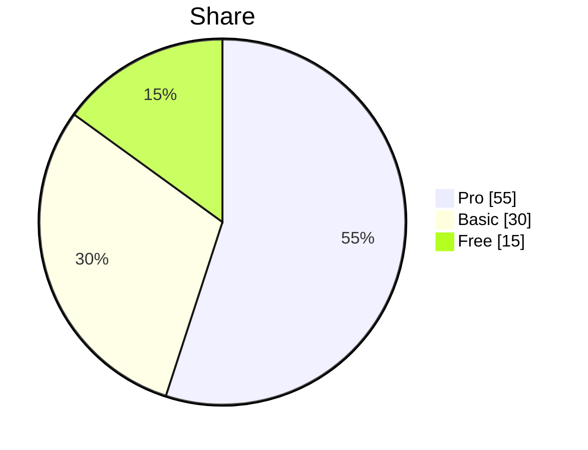
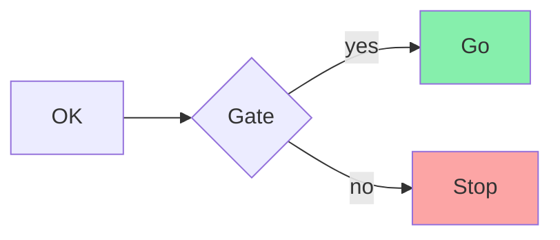

# Mermaid Patterns

## Class diagram

## Gantt

## Git graph

## Mindmap

## Pie

## Styling tips

## Escaping

- Node text with parens/brackets: `A["process (main)"]`
- Edge labels with special chars: `A -->|"a → b"| B`
- Never use `end` as an id; use `endNode`
